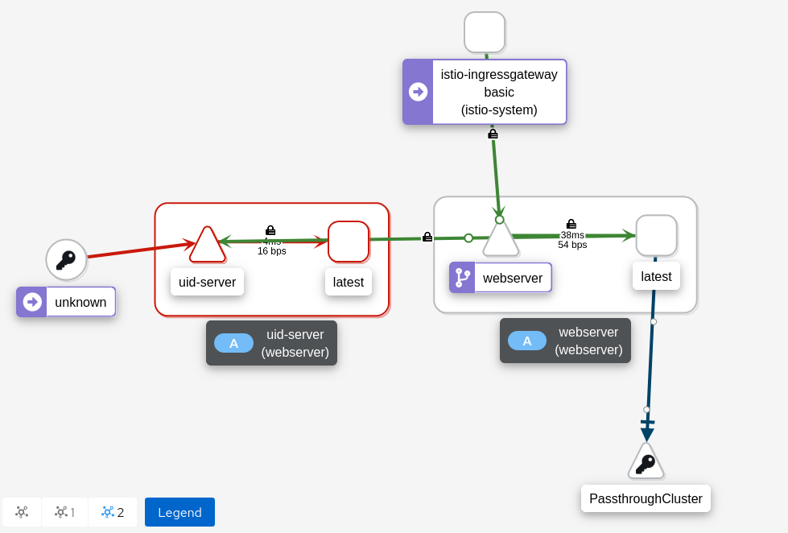
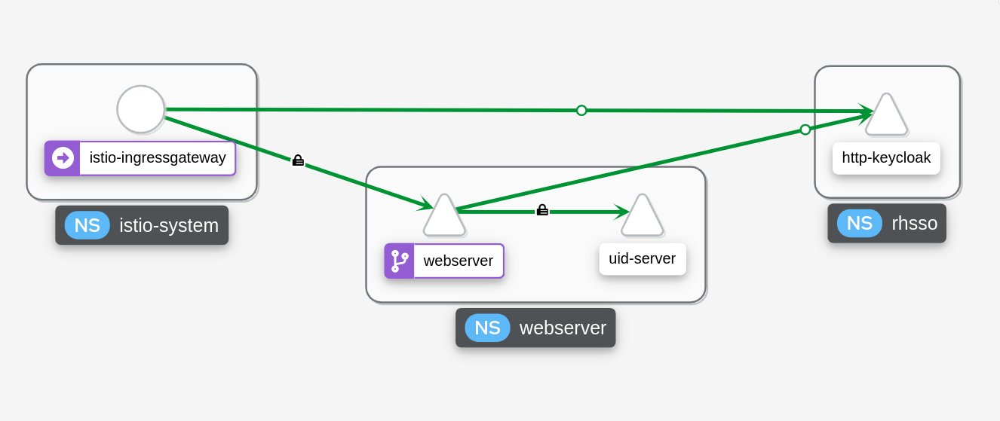
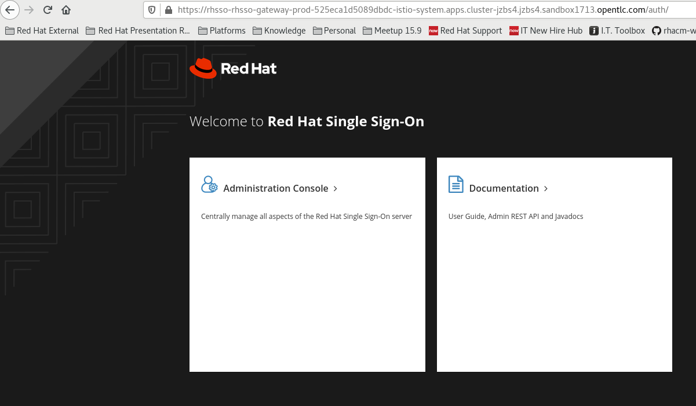

# RHSSO Istio

This repository shows how you can onboard Red Hat Single Sign On into Red Hat Service Mesh.

## Overview

In many cases, organizations want to be able to see traffic flows from and to the OIDC server. If the OIDC server is not a member of the mesh, it will be represented as `PassthroughCluster` and there will be no information about the connection. As shown in the diagram below -



Importing RHSSO into the mesh provides much needed information and control over network traffic, as shown in the diagram below -



## Integration

This section describes the steps that need to be taken in order to integrate RHSSO with Service Mesh -

### Install RHSSO

Install RHSSO using the official Redhat operator and create an instance of the Keycloak CR. To install the operator on OpenShift 4.9, you may run the following commands, otherwise, follow the [official documentation](https://access.redhat.com/documentation/en-us/red_hat_single_sign-on/7.5/html/server_installation_and_configuration_guide/operator).

```
$ oc apply -f rhsso-operator/namespace.yaml

$ oc apply -f rhsso-operator/subscription.yaml

# Wait for two minutes before running this command
$ oc apply -f rhsso-operator/keycloak.yaml
```

### Configure Service Mesh Ingress Gateway

Add the default openshift-router certificates into istio's ingress-router. To extract the certificates run the next command -

```
$ oc extract secret/router-certs --to=- -n openshift-ingress
```

Place the certificate and private key in files on your workstation and run the next command to create a secret for istio's ingress router -

```
$ oc create secret tls istio-ingressgateway-certs --key=key.key --cert=cert.crt -n istio-system
```

Restart the _istio-ingressgateway_ deployment -

```
$ oc rollout restart deployment/istio-ingressgateway -n istio-system
```

The default ingress certificate should now be propogated in istio's ingress gateway.

### Add RHSSO into Service Mesh

Make sure to add the _rhsso_ namespace into the mesh. You may verify that it's present in the _ServiceMeshMemberRoll_ resource -

```
$ oc get smmr -n istio-system -o yaml
...
apiVersion: maistra.io/v1
kind: ServiceMeshMemberRoll
metadata:
  name: default
  namespace: istio-system
spec:
  members:
...
  - rhsso
...
```

### Integrate RHSSO with Service Mesh

To integrate RHSSO with Service Mesh, you can deploy the chart assosiated with this repository. Edit `rhsso.hostname` in the [values.yaml](rhsso-istio-chart/values.yaml) file. The parameter defines the hostname that's going to be exposed via istio's ingress gateway.

After you modify the values file, install the helm chart using the helm binary -

```
$ helm install --generate-name --namespace rhsso rhsso-istio-chart
```

Validate that RHSSO is exposed via istio's ingress gateway -

```
$ oc get route -n istio-system
NAME                                           HOST/PORT                                                                                                    PATH   SERVICES               PORT          TERMINATION          WILDCARD
rhsso-rhsso-gateway-prod-254780724443febc      rhsso-rhsso-gateway-prod-525eca1d5089dbdc-istio-system.apps.cluster-jzbs4.jzbs4.sandbox1713.opentlc.com             istio-ingressgateway   https         passthrough          None
```

Navigate to the hostname defined by the route -

